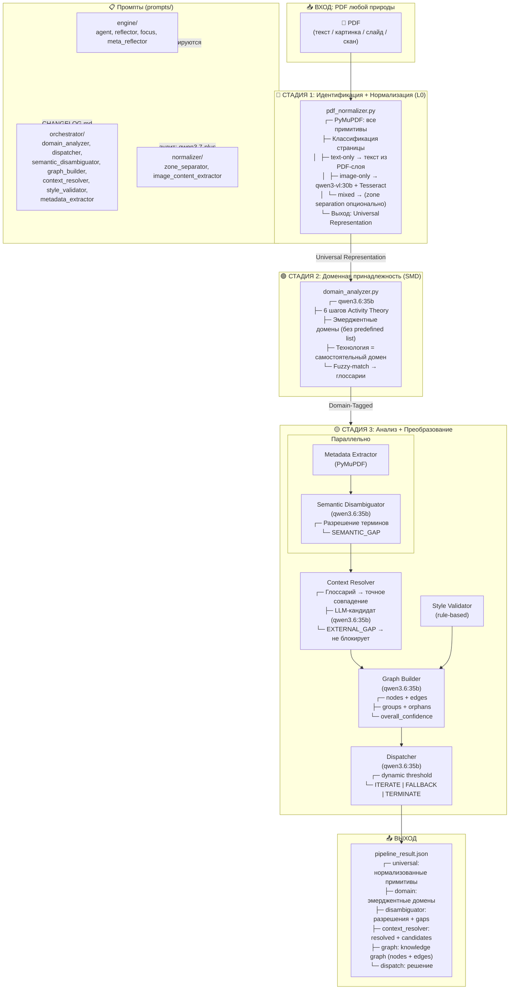

# Архитектура MAS Doc Orchestrator

## Модели

| Модель | Роль | Где |
|--------|------|-----|
| **PyMuPDF** | Детерминированная экстракция | Normalizer, Metadata |
| **qwen3-vl:30b** | Vision (изображения → текст) | Normalizer (image-only) |
| **qwen3.6:35b** | Reasoning (СМД, графы, решения) | Domain, Disambiguator, Context, Graph, Dispatcher |
| **Tesseract** | OCR fallback | Normalizer (image-only) |
| **qwen3.7-plus** ☁️ | Методологический аудит промптов | prompts/AUDIT.md |

## Ключевые принципы

1. **Никаких SKIP** — любой PDF → Universal Representation
2. **Домен эмерджентен** — из структуры деятельности, не из predefined list
3. **Глоссарий не блокирует** — EXTERNAL_GAP = кандидат на пополнение
4. **Промпты версионируются** — prompts/ + CHANGELOG.md + audit