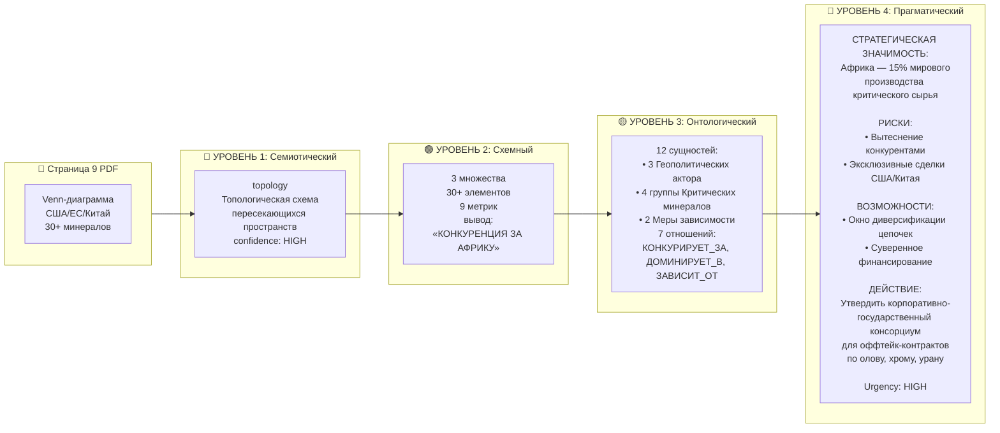

# Страница 9: от PDF до C-level вывода

## Было → Стало

| Измерение | Было (token-level) | Стало (4 уровня) |
|-----------|-------------------|------------------|
| **Что извлекли** | «Золото» (1 слово) | 12 сущностей, 7 отношений, C-level вывод |
| **Что поняли** | Ничего | Конкуренция за ресурсы Африки |
| **Что потеряли** | Venn-структуру, метрики, вывод, геополитику | Ничего |
| **Что можно сделать** | Ничего | Принять стратегическое решение |
| **Confidence** | — | MEDIUM (честно) |
| **Urgency** | — | HIGH |

## Ценность для C-level

> **Вместо:** «На странице 9 есть слово "Золото"»
>
> **Получает:** «Африка генерирует 15% мирового производства критических минералов. США, ЕС и Китай конкурируют за контроль. Россия вытесняется. Рекомендую: создать консорциум для оффтейк-контрактов по олову, хрому, урану в течение 12 месяцев. Urgency: HIGH.»